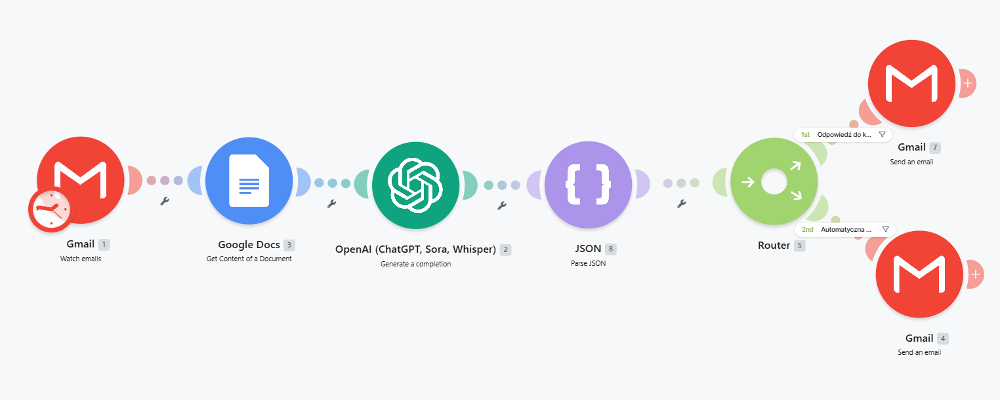
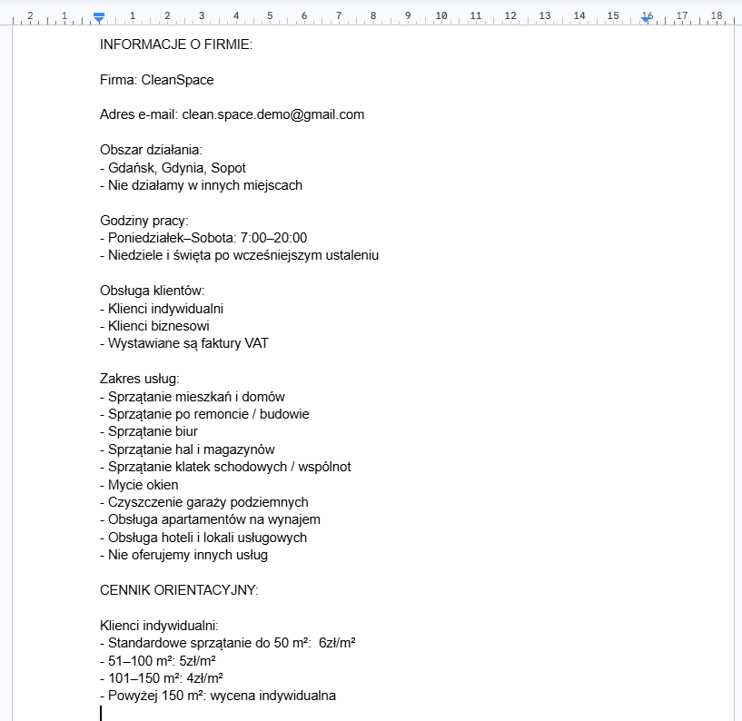
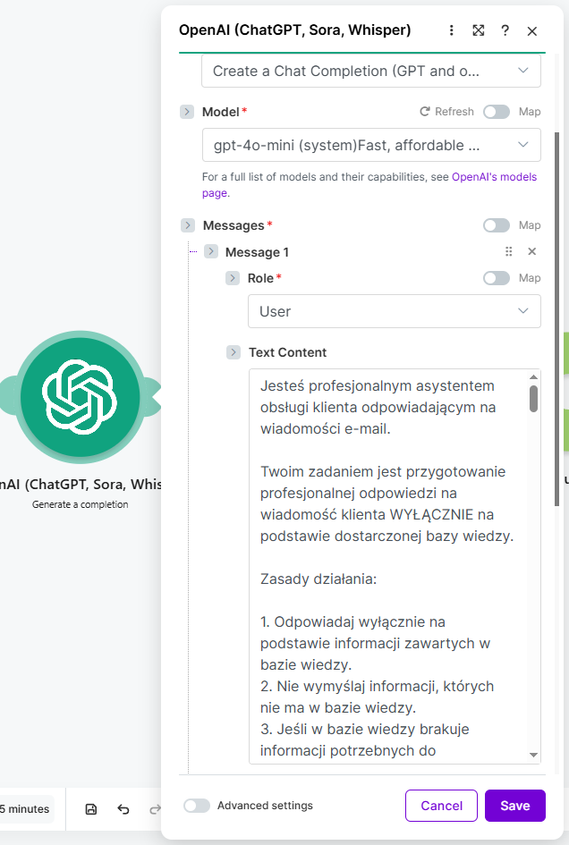
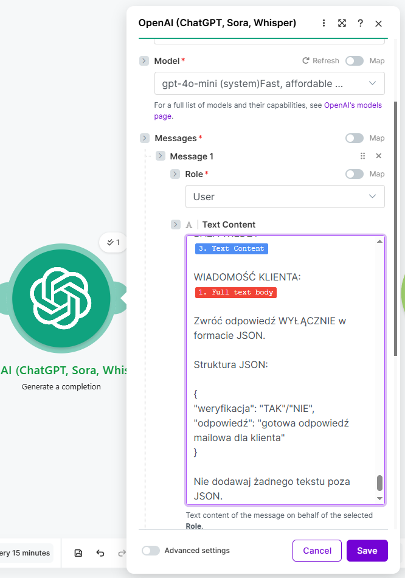
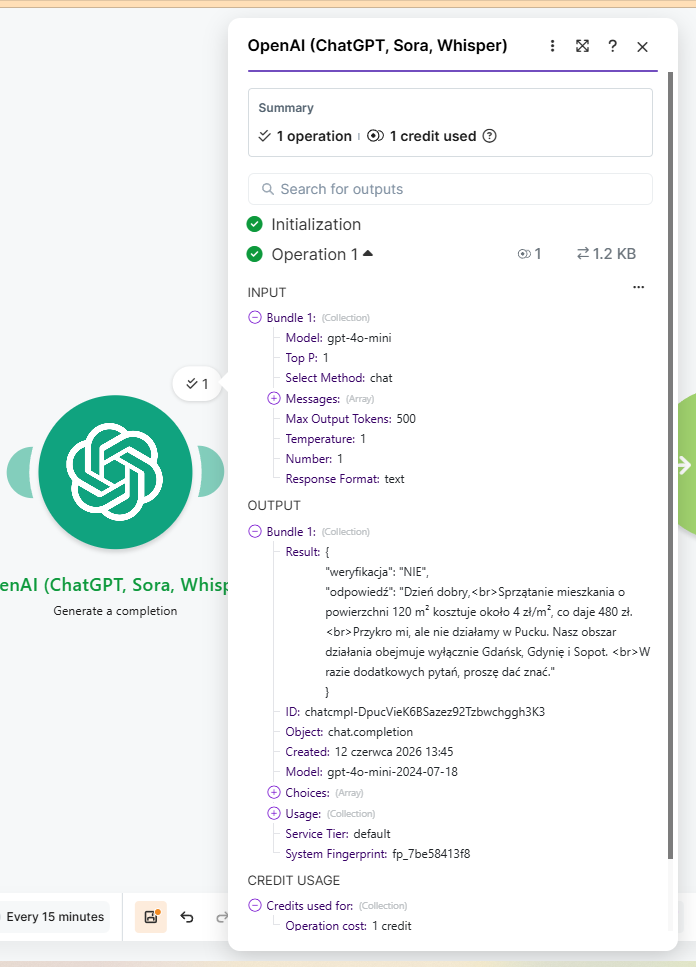
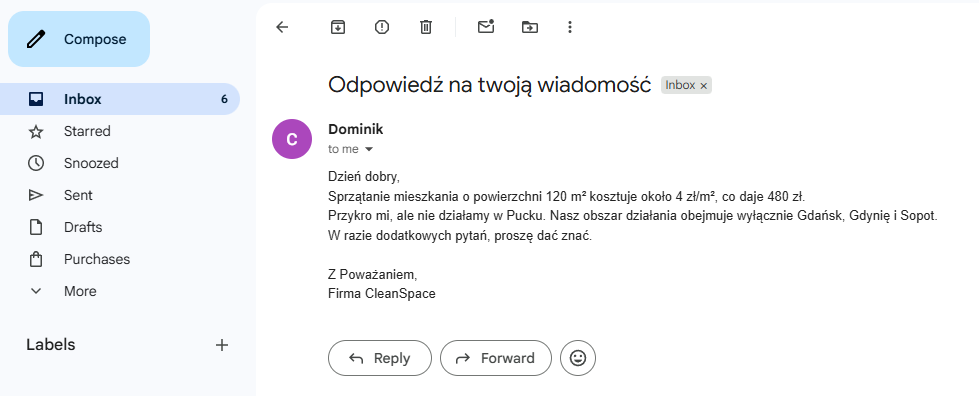
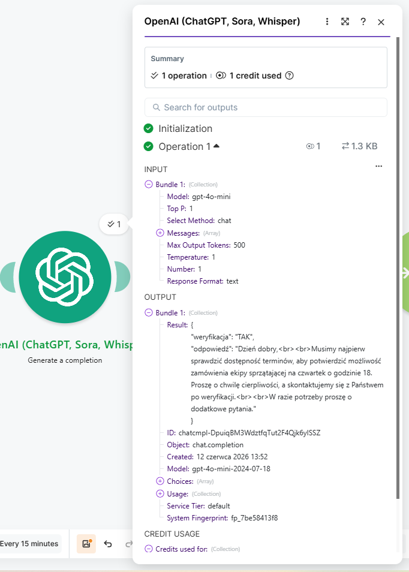
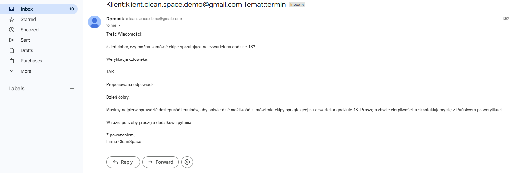

# AI Email Triage System

## **Opis projektu**

System wykorzystujący sztuczną inteligencję do analizy wiadomości email, generowania odpowiedzi oraz podejmowania decyzji, czy odpowiedź wymaga weryfikacji człowieka.

Projekt wykorzystuje bazę wiedzy przechowywaną w Google Docs oraz model OpenAI do przygotowania odpowiedzi zgodnych z dostępną dokumentacją.

---

## **Problem biznesowy**

Wiele wiadomości klientów dotyczy prostych i powtarzalnych pytań, jednak część z nich wymaga indywidualnej oceny pracownika.

Projekt automatyzuje analizę wiadomości oraz rozdziela zgłoszenia na:

* możliwe do automatycznej obsługi,
* wymagające weryfikacji człowieka.

---

## **Technologie**

* Make
* OpenAI API
* Gmail
* Google Docs
* JSON

---

## **Architektura rozwiązania**

Klient → Gmail → Google Docs (baza wiedzy) → OpenAI API → JSON (decyzja) → Router

### Ścieżka 1 – Automatyczna odpowiedź

Router → Gmail → Klient

### Ścieżka 2 – Weryfikacja przez człowieka

Router → Gmail (pracownik) → Weryfikacja → Gmail → Klient

---

## **Funkcje**

* analiza treści wiadomości email,
* wykorzystanie bazy wiedzy zapisanej w Google Docs,
* generowanie odpowiedzi przez AI,
* ocena pewności odpowiedzi,
* automatyczne podejmowanie decyzji o eskalacji,
* obsługa modelu Human-in-the-Loop,
* automatyczne wysyłanie odpowiedzi dla prostych spraw.

---

## Przykładowe działanie

### Workflow w Make

### Fragment bazy wiedzy

### Początek promptu systemowego

### Końcówka promptu systemowego

### Wynik klasyfikacji – odpowiedź automatyczna

### Automatyczna odpowiedź dla klienta

### Wynik klasyfikacji – wymagana weryfikacja

### Odpowiedź przekazana do weryfikacji

---

## Ograniczenia

* skuteczność odpowiedzi zależy od jakości i kompletności bazy wiedzy,
* system odpowiada wyłącznie na podstawie dostarczonych informacji i nie posiada dostępu do zewnętrznych systemów firmy,
* błędnie sformułowane lub niejednoznaczne wiadomości mogą zostać zakwalifikowane do weryfikacji przez człowieka,
* system nie potwierdza terminów, dostępności ani innych danych dynamicznych bez odpowiednich informacji wejściowych,
* odpowiedzi generowane przez AI mogą wymagać dodatkowej kontroli w przypadku nietypowych lub złożonych zapytań,
* projekt nie obsługuje załączników ani analizy dokumentów przesyłanych przez klientów,
* jakość klasyfikacji zależy od poprawności promptu oraz zdefiniowanych reguł decyzyjnych,
* projekt został przygotowany jako demonstracja wykorzystania AI do automatyzacji obsługi klienta i modelu Human-in-the-Loop.

---

## **Czego nauczyłem się podczas realizacji projektu**

* integracji Gmail z Make,
* wykorzystania OpenAI API w procesach biznesowych,
* projektowania workflow Human-in-the-Loop,
* pracy z formatem JSON,
* budowy systemów wspierających obsługę klienta,
* podejmowania decyzji przez AI na podstawie zdefiniowanych kryteriów.

